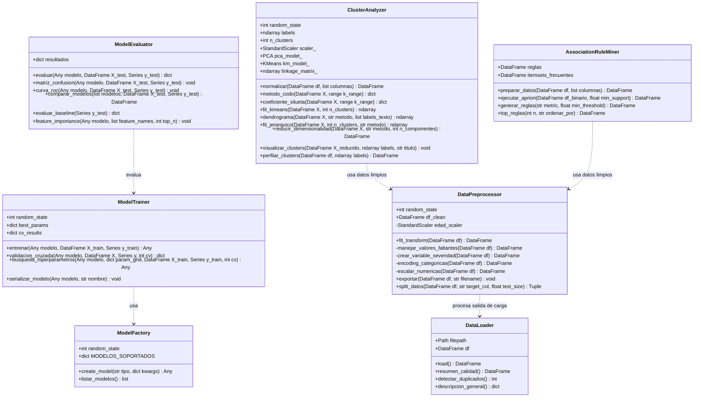
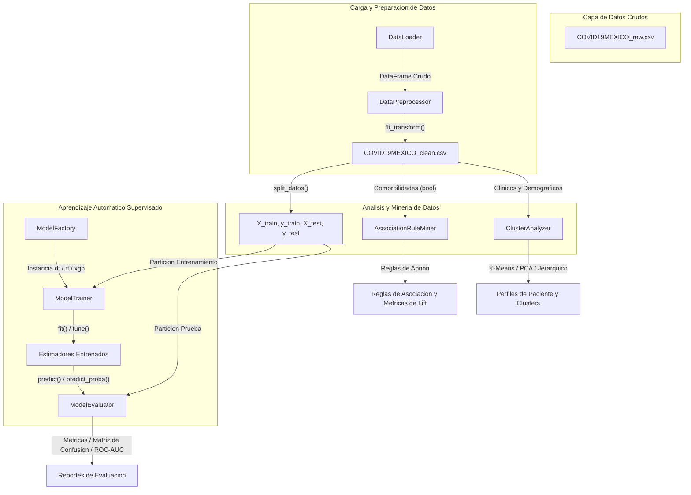

# Diagramas UML del Proyecto

## 1. Diagrama de Clases

El siguiente diagrama de clases representa la estructura, atributos, métodos y relaciones de las clases principales dentro del directorio `src/` (módulos `data/`, `models/` y `utils/`).

## 2. Arquitectura del Sistema y Flujo de Datos

El siguiente diagrama detalla el flujo operativo de los datos, desde la ingesta del archivo crudo, pasando por el preprocesamiento, hasta los módulos de análisis paralelos.

